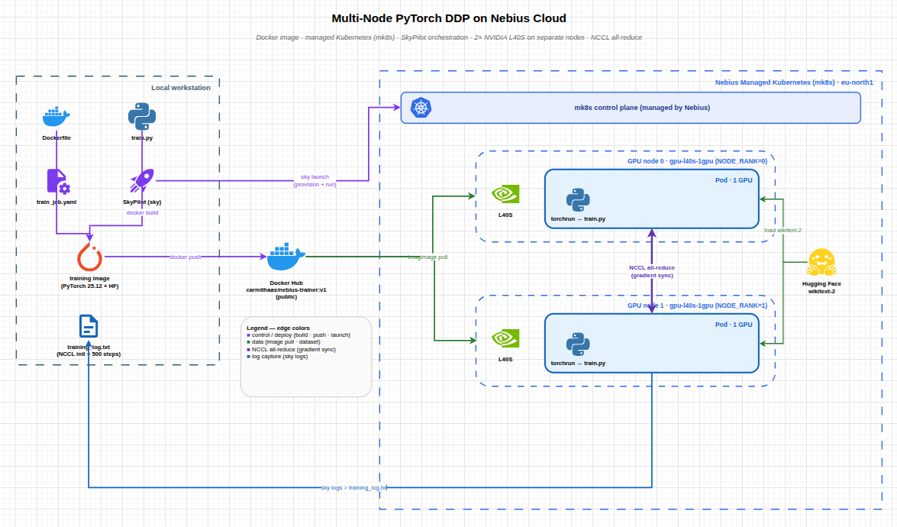
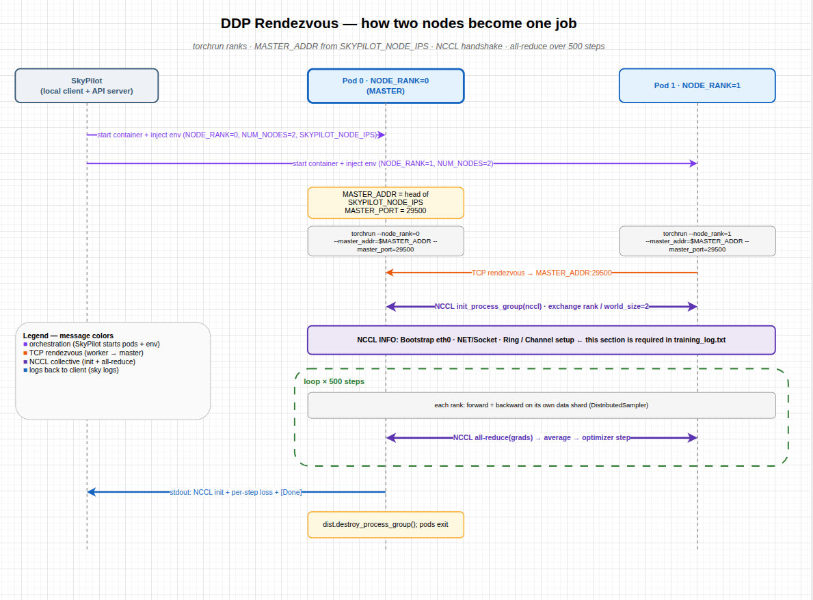
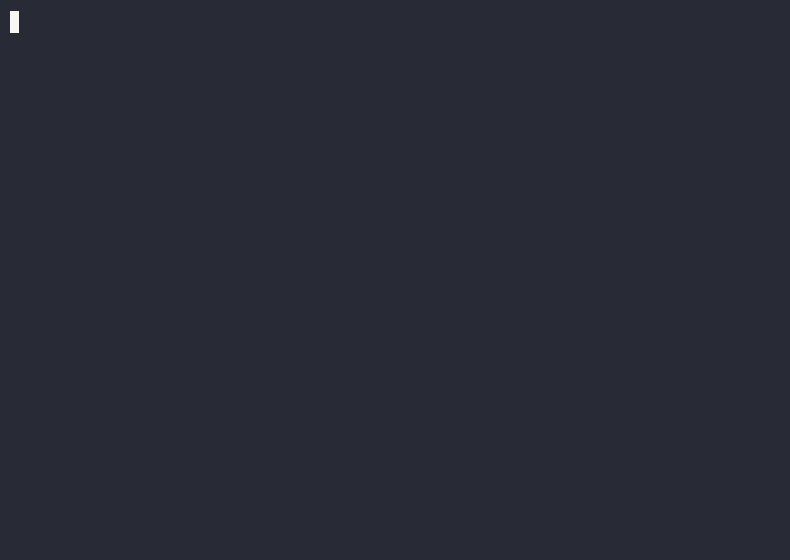

# Multi-Node PyTorch DDP on Nebius

Training one model across **two GPUs that live on two separate machines**, orchestrated with SkyPilot on a Nebius managed Kubernetes cluster. The model is small on purpose; the point is the distributed plumbing: a containerized training job, a 2-node GPU cluster, and a clean NCCL handshake that proves the two GPUs trained as a single job.


---

## What I built

I ran a PyTorch [Distributed Data Parallel](https://pytorch.org/tutorials/intermediate/ddp_tutorial.html) job across **2 nodes, 1 GPU each (world size 2)** on Nebius. Each GPU holds a full copy of `facebook/opt-1.3b` and trains on a different slice of wikitext-2 for 500 steps. After every step the two GPUs average their gradients with an NCCL all-reduce, so the two copies stay identical.

The whole thing is one YAML file handed to SkyPilot. SkyPilot provisions the pods on the GPU nodes, wires their network identities together, and launches `torchrun` on both so the ranks find each other.



<sub>Diagram source: [`docs/diagrams/architecture.drawio`](docs/diagrams/architecture.drawio). Export to PNG from the drawio editor to refresh this image.</sub>

---

## How it works

The interesting part is the rendezvous: how two pods on two machines become one training job.

1. SkyPilot starts a pod on each node and injects `SKYPILOT_NODE_RANK`, `SKYPILOT_NUM_NODES`, and `SKYPILOT_NODE_IPS`.
2. Both pods compute `MASTER_ADDR` as the first IP in `SKYPILOT_NODE_IPS`, with `MASTER_PORT=29500`.
3. Each pod runs `torchrun` with its own `--node_rank`. Rank 0 is the master; rank 1 connects to it.
4. `dist.init_process_group(backend="nccl")` builds the collective. This is where NCCL prints its `Bootstrap`, `NET/Socket`, and `Ring`/`Channel` lines. That section is the proof the two GPUs talk, and it is in [`training_log.txt`](training_log.txt).
5. For 500 steps, each rank does forward and backward on its own data shard, then an NCCL all-reduce averages the gradients before the optimizer step.



<sub>Diagram source: [`docs/diagrams/rendezvous.drawio`](docs/diagrams/rendezvous.drawio).</sub>

---

## The files

| File | What it is |
|---|---|
| [`Dockerfile`](Dockerfile) | Training image on top of `nvcr.io/nvidia/pytorch:25.12-py3` with transformers, datasets, accelerate, and friends. |
| [`train.py`](train.py) | The DDP training script: NCCL init, HF `Trainer`, bf16, 500 steps on wikitext-2. |
| [`train_job.yaml`](train_job.yaml) | The SkyPilot task: 2 nodes, 1 L40S each, the image, and the `torchrun` launch using SkyPilot's node/rank variables. |
| [`mk8s-ng-config.json`](mk8s-ng-config.json) | The Nebius node-group spec, showing the 2-GPU node group. |
| [`training_log.txt`](training_log.txt) | The full `sky logs` output, including the NCCL initialization section. |

---

## Reproduce it

### Cold prep (no GPU needed)

```bash
# build the training image and push it to a public registry
docker build -t docker.io/carmithaas/nebius-trainer:v2 .
docker push docker.io/carmithaas/nebius-trainer:v2

# install the clients
uv tool install --with pip "skypilot[nebius]"
# the Nebius CLI: https://docs.nebius.com/cli/install
```

### The GPU run (Nebius, eu-north1)

```bash
# 1. create a managed Kubernetes cluster with a 2-node L40S group (preset 1gpu-16vcpu-96gb, 100 GB SSD)
# 2. fetch credentials
nebius mk8s cluster get-credentials --id <CLUSTER_ID> --external --kubeconfig ~/.kube/config
kubectl get nodes                       # two nodes, Ready

# 3. save the node-group spec
nebius mk8s node-group get --id <NG_ID> --format json | jq '{metadata, spec}' > mk8s-ng-config.json

# 4. point SkyPilot at the cluster (local API server, no shared server needed)
sky api start
sky check kubernetes

# 5. set infra: k8s/<cluster-name> in train_job.yaml, then launch
sky launch -c ddp-run train_job.yaml
sky logs ddp-run > training_log.txt     # contains the NCCL init section

# 6. tear down to stop billing
sky down ddp-run                         # then delete the cluster
```

The step-by-step version, with cost notes and quota checks, is in [`docs/runbook.md`](docs/runbook.md).

---

## Results

The two GPUs, one per node, formed a single NCCL communicator across the network and trained
together for all 500 steps. The lines that matter, from [`training_log.txt`](training_log.txt):

```text
[NCCL] World size: 2
[NCCL] Backend: nccl
[NCCL] Master addr: 10.5.14.107   Master port: 29500
NCCL INFO NET/IB : Using [RO]; OOB eth0:10.5.15.21<0>
NCCL INFO ncclCommInitRankConfig comm ... rank 1 nranks 2 ... Init START
NCCL INFO comm ... rank 1 nRanks 2 nNodes 2 localRanks 1 localRank 0
NCCL INFO ncclCommInitRankConfig comm ... rank 1 nranks 2 ... Init COMPLETE
NCCL INFO Channel 00/0 : 0[0] -> 1[0] [receive] via NET/Socket/0
[Done] Training complete — 500 steps finished.
```

`nNodes 2` is the proof the two GPUs sat on two separate machines, not one box with two cards.

- Run: 500 steps, world size 2, bf16, `facebook/opt-1.3b` on wikitext-2.
- Throughput: ~2.74 s/step, `train_runtime` 1418s (~23.6 min), 2.82 samples/s.
- Hardware: 2 × NVIDIA L40S (1 per node), each near 100% utilization, ~18.8 GB of 46 GB used.
- Image: 9.2 GB compressed, pulled onto each node in about 6.5 min.
- Stack: PyTorch 2.10 (CUDA 13.1), transformers 5.12, datasets 5.0, NVIDIA driver 580.

This is a short pipeline-validation run (small model, 500 steps, a deliberately low learning rate),
so the goal is proving the distributed setup end to end, not chasing a converged model.

> **Why L40S (the reference setup used H100):** my H100 quota didn't come through in time for the
> submission window, so the run uses 2× L40S with the matching smaller preset (`1gpu-16vcpu-96gb`).
> The topology is what the exercise is about and it is unchanged: 2 nodes, 1 GPU each, world size 2,
> the same NCCL rendezvous, the same job YAML. Only raw throughput differs.



<sub>Recording of the live `sky logs` stream: the NCCL handshake followed by the training steps.</sub>

---

## What I took away

A few things that actually came up building this:

- The NVIDIA PyTorch base image is large (about 20 GB), so getting it to a registry is the real
  bottleneck, not the training. I built and pushed it from a Nebius CPU VM with datacenter-speed
  egress rather than over a home uplink, and kept later changes as thin layers on top so only the
  small delta had to upload.
- The stock training image needs `openssh-server` and `rsync` for SkyPilot's multi-node Kubernetes
  runtime, since the head and worker pods rendezvous over SSH. Without them the head pod exits
  during setup with `sed: can't read /etc/ssh/sshd_config`.
- The `datasets` 5.0 library rejects the legacy bare name `wikitext`; it has to be the namespaced
  `Salesforce/wikitext`.
- The NCCL log is the thing to read. `nNodes 2` and the `Channel 0[0] -> 1[0] ... via NET/Socket`
  lines confirm the two GPUs really are on separate nodes talking over the network.

---

## Repo layout

```
.
├── Dockerfile              # training image
├── train.py                # DDP training script
├── train_job.yaml          # SkyPilot task
├── mk8s-ng-config.json     # Nebius node-group spec (from the run)
├── training_log.txt        # sky logs, with NCCL init (from the run)
└── docs/
    ├── diagrams/           # architecture + rendezvous (drawio + png), run screenshots, recording
    └── runbook.md          # the GPU-run runbook
```

The top-level files are the runnable core of the project; everything under `docs/` is supporting documentation.
